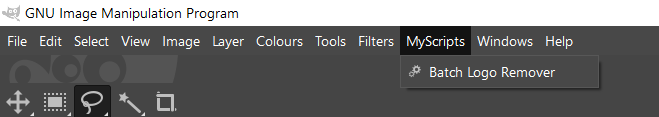

# Scheme Code Explanation

This document explains two functions in Scheme: `filename-basename` and `batch-logo-remover`. The first function extracts the base name of a file, while the second function removes a logo from a batch of images.

## Function: filename-basename

```scheme
(define (filename-basename orig-name)
  (let* ((name-without-path (car (last (strbreakup orig-name "\\"))))
         (name-without-extension (car (strbreakup name-without-path "."))))
    name-without-extension))
```

This function takes a single argument, `orig-name`, which is the original file name. It returns the base name of the file without the path and extension.

### Explanation

1. `name-without-path`: It splits the `orig-name` using the "\\" delimiter and takes the last element of the resulting list, which is the file name without the path.
2. `name-without-extension`: It splits the `name-without-path` using the "." delimiter and takes the first element of the resulting list, which is the file name without the extension.
3. The function returns `name-without-extension`.

## Function: batch-logo-remover

```scheme
(define (batch-logo-remover input-folder output-folder logo-x logo-y logo-width logo-height)
  (let* ((filelist (cadr (file-glob (string-append input-folder "\\*.png") 1))))
    (while (not (null? filelist))
      (let* ((filename (car filelist))
             (image (car (gimp-file-load RUN-NONINTERACTIVE filename filename)))
             (drawable (car (gimp-image-get-active-layer image))))
        (gimp-rect-select image logo-x logo-y logo-width logo-height CHANNEL-OP-REPLACE FALSE 0)
        (python-fu-heal-selection RUN-NONINTERACTIVE image drawable 50 TRUE TRUE)
        (gimp-selection-none image)
        (let ((output-filename (string-append output-folder "\\" (filename-basename filename) ".png")))
          (gimp-file-save RUN-NONINTERACTIVE image drawable output-filename output-filename)
          (gimp-image-delete image)))
      (set! filelist (cdr filelist)))))
```

This function takes the following arguments:

- `input-folder`: The folder containing the input images.
- `output-folder`: The folder where the processed images will be saved.
- `logo-x`, `logo-y`, `logo-width`, `logo-height`: The position and dimensions of the logo to be removed.

### Explanation

1. `filelist`: It generates a list of PNG files in the `input-folder`.
2. The `while` loop iterates through the `filelist` until it is empty.
3. For each file in the `filelist`:
   - Load the image using `gimp-file-load`.
   - Get the active layer of the image using `gimp-image-get-active-layer`.
   - Select the logo area using `gimp-rect-select`.
   - Remove the logo using `python-fu-heal-selection`.
   - Deselect the selection using `gimp-selection-none`.
   - Save the processed image in the `output-folder` with the same base name as the input file and a ".png" extension.
   - Delete the image from memory using `gimp-image-delete`.
4. Move to the next file in the `filelist` using `(set! filelist (cdr filelist))`.

# How to use the batch-logo-remover function

Keep in mind that this code is written in Scheme and uses GIMP's Script-Fu API. To run this code, you need to have GIMP installed, as well as the Resynthesizer plugin. And of course, a source of PNGs, in case you have a video with a nasty logo or some persistent minor imperfection you want to remove, just be sure to have FFMPEG installed and use the following commands:

#### Decoding video into PNGs:
```
ffmpeg -i input.mkv image%d.png
```

#### Encoding video from PNGs:
  Make sure to use more parameters like framerate and color space depending on playback device.
```
ffmpeg -i image%d.png output.mkv
```

Installing the script:

1. Save the script as a .scm file (e.g., "batch-logo-remover.scm") and place it in GIMP scripts folder. The location of this folder depends on your operating system and GIMP installation.
2. Open GIMP and go to `Filters` > `Script-Fu` > `Refresh Scripts`. This will make GIMP recognize your new script (restart GIMP if it fails to do so).

To use the `batch-logo-remover` function, you need to provide the required arguments:

1. `input-folder`: The folder containing the input images (e.g., "C:\input-images").
2. `output-folder`: The folder where the processed images will be saved (e.g., "C:\output-images").
3. `logo-x`, `logo-y`: The x and y coordinates of the top-left corner of the logo in the images (e.g., 100 and 200).
4. `logo-width`, `logo-height`: The width and height of the logo (e.g., 50 and 50).

Here's an example of how to call the `batch-logo-remover` function with these arguments:


1. Open GIMP.
2. Go to `Filters` > `Script-Fu` > `Console` to open the Script-Fu console.
3. In the Script-Fu, you can now call the `batch-logo-remover` function with your desired arguments. For example:

   ```scheme
   (batch-logo-remover "C:\input-images" "C:\output-images" 100 200 50 50)
   ```

   Replace the folder paths and logo coordinates dimensions with your own values.

4. Press `Enter` to run the function. GIMP will process the images in the input folder, remove the specified logo, and save the processed images in the output folder.

From context menu:




