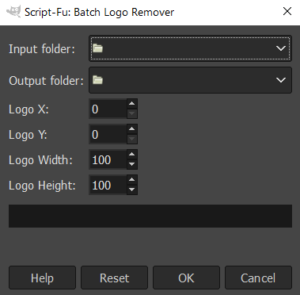

# Explicação do Código Scheme

Este documento explica duas funções em Scheme: `filename-basename` e `batch-logo-remover`. A primeira função extrai o nome base de um arquivo, enquanto a segunda função remove um logotipo de um lote de imagens.

## Função: filename-basename

```scheme
(define (filename-basename orig-name)
  (let* ((name-without-path (car (last (strbreakup orig-name "\\"))))
         (name-without-extension (car (strbreakup name-without-path "."))))
    name-without-extension))
```

Esta função recebe um único argumento, `orig-name`, que é o nome original do arquivo. Ela retorna o nome base do arquivo sem o caminho e a extensão.

### Explicação

1. `name-without-path`: Ele divide o `orig-name` usando o delimitador "\\" e pega o último elemento da lista resultante, que é o nome do arquivo sem o caminho.
2. `name-without-extension`: Ele divide o `name-without-path` usando o delimitador "." e pega o primeiro elemento da lista resultante, que é o nome do arquivo sem a extensão.
3. A função retorna `name-without-extension`.

## Função: batch-logo-remover

```scheme
(define (batch-logo-remover input-folder output-folder logo-x logo-y logo-width logo-height)
  (let* ((filelist (cadr (file-glob (string-append input-folder "\\*.png") 1))))
    (while (not (null? filelist))
      (let* ((filename (car filelist))
             (image (car (gimp-file-load RUN-NONINTERACTIVE filename filename)))
             (drawable (car (gimp-image-get-active-layer image))))
        (gimp-rect-select image logo-x logo-y logo-width logo-height CHANNEL-OP-REPLACE FALSE 0)
        (python-fu-heal-selection RUN-NONINTERACTIVE image drawable 50 TRUE TRUE)
        (gimp-selection-none image)
        (let ((output-filename (string-append output-folder "\\" (filename-basename filename) ".png")))
          (gimp-file-save RUN-NONINTERACTIVE image drawable output-filename output-filename)
          (gimp-image-delete image)))
      (set! filelist (cdr filelist)))))
```

Esta função recebe os seguintes argumentos:

- `input-folder`: A pasta contendo as imagens de entrada.
- `output-folder`: A pasta onde as imagens processadas serão salvas.
- `logo-x`, `logo-y`, `logo-width`, `logo-height`: A posição e as dimensões do logotipo a ser removido.

### Explicação

1. `filelist`: Ele gera uma lista de arquivos PNG na `input-folder`.
2. O loop `while` itera através do `filelist` até que esteja vazio.
3. Para cada arquivo no `filelist`:
   - Carrega a imagem usando `gimp-file-load`.
   - Obtém a camada ativa da imagem usando `gimp-image-get-active-layer`.
   - Seleciona a área do logotipo usando `gimp-rect-select`.
   - Remove o logotipo usando `python-fu-heal-selection`.
   - Deseleciona a seleção usando `gimp-selection-none`.
   - Salva a imagem processada na `output-folder` com o mesmo nome base que o arquivo de entrada e uma extensão ".png".
   - Exclui a imagem da memória usando `gimp-image-delete`.
4. Move para o próximo arquivo no `filelist` usando `(set! filelist (cdr filelist))`.

# Como usar a função batch-logo-remover

Lembre-se de que este código é escrito em Scheme e usa a API Script-Fu do GIMP. Para executar este código, você precisa ter o GIMP instalado, bem como o plugin Resynthesizer. E claro, uma fonte de PNGs, caso você tenha um vídeo com um logotipo indesejado ou alguma pequena imperfeição persistente que deseja remover, basta ter o FFMPEG instalado e usar os seguintes comandos:

#### Decodificando vídeo em PNGs:
```
ffmpeg -i input.mkv image%d.png
```

#### Codificando vídeo a partir de PNGs:
  Use mais parâmetros como framerate e color space, a depender do player.
```
ffmpeg -i image%d.png output.mkv
```

Instalando o script:

1. Salve o script como um arquivo .scm (por exemplo, "batch-logo-remover.scm") e coloque-o na pasta de scripts do GIMP. A localização desta pasta depende do seu sistema operacional e da instalação do GIMP.
2. Abra o GIMP e vá para `Filtros` > `Script-Fu` > `Atualizar Scripts`. Isso fará com que o GIMP reconheça seu novo script (reinicie o GIMP caso não atualize).

Para usar a função `batch-logo-remover`, você precisa fornecer os argumentos necessários:

1. `input-folder`: A pasta contendo as imagens de entrada (por exemplo, "C:\input-images").
2. `output-folder`: A pasta onde as imagens processadas serão salvas (por exemplo, "C:\output-images").
3. `logo-x`, `logo-y`: As coordenadas x e y do canto superior esquerdo do logotipo nas imagens (por exemplo, 100 e 200).
4. `logo-width`, `logo-height`: A largura e a altura do logotipo (por exemplo, 50 e 50).

Aqui está um exemplo de como chamar a função `batch-logo-remover` com esses argumentos:

1. Abra o GIMP.
2. Vá para `Filtros` > `Script-Fu` > `Console` para abrir o console Script-Fu.
3. No Script-Fu, você pode agora chamar a função `batch-logo-remover` com seus argumentos desejados. Por exemplo:

   ```scheme
   (batch-logo-remover "C:\input-images" "C:\output-images" 100 200 50 50)
   ```

   Substitua os caminhos das pastas e as dimensões das coordenadas do logotipo pelos seus próprios valores.

4. Pressione `Enter` para executar a função. O GIMP processará as imagens na pasta de entrada, removerá o logotipo especificado e salvará as imagens processadas na pasta de saída.

A partir do menu de seleção:


